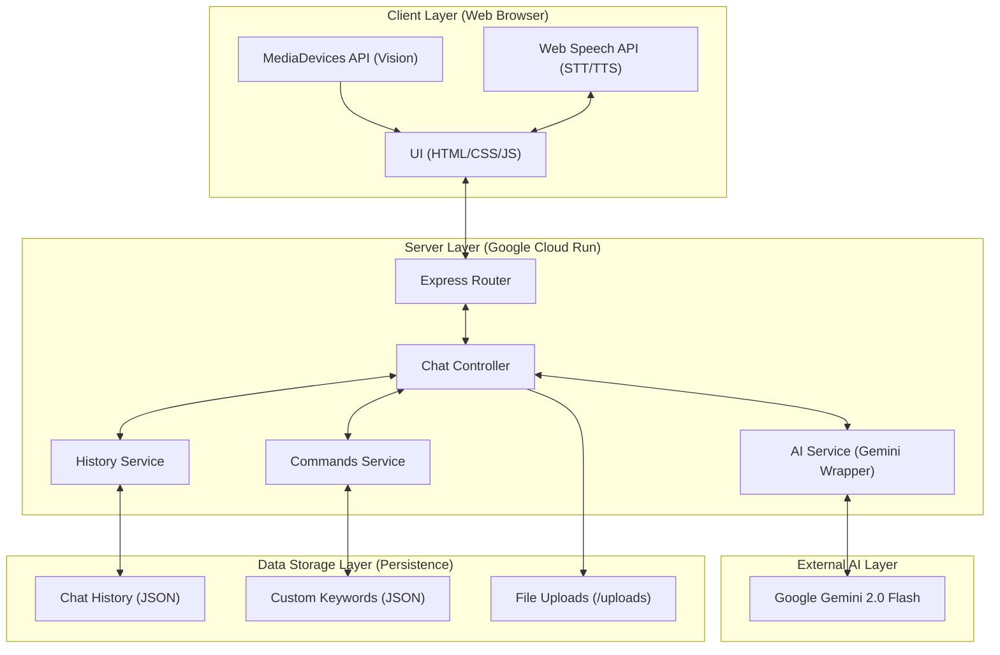
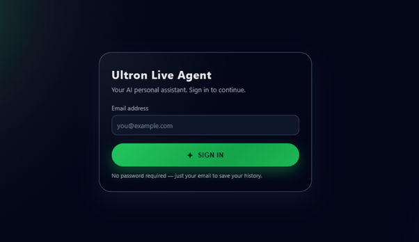
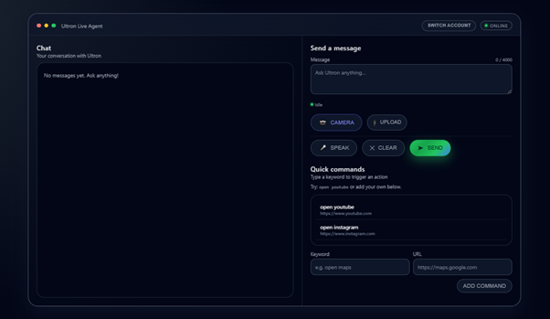

# ⚡ Ultron — Your AI Personal Assistant

**📺 [Watch Demo Video](https://youtu.be/GIhcZOY3DEI)** | **🏆 [Hackathon Submission](https://devpost.com/software/live-agent-ultron)**

---

Ultron is a sleek, fast, and powerful AI assistant that lives in your browser. Talk to it, give it commands, and it gets things done — opening websites, answering questions, reading files, and more. Built on Google Gemini, it's smart, responsive, and completely yours to run locally.

---

## 🚀 Quick Start

> **Prerequisites:** You need [Node.js](https://nodejs.org/) installed and a free [Gemini API key](https://aistudio.google.com/apikey).

**1. Clone the repository**
```bash
git clone <your-repo-url>
cd Live-agent-Ultron
```

**2. Add your API key**

Open the `.env` file in the root folder and paste your key:
```env
GEMINI_API_KEY=your_key_here
```

**3. Install dependencies**
```bash
npm install
```

**4. Launch the app**
```bash
npm run dev
```

**5. Open in your browser**

`Ctrl + Click` the link in the terminal, or go to [http://localhost:3000](http://localhost:3000).

That's it. You're in.

---

## 🧪 Reproducible Testing

Once the app is running, follow these steps to verify its core capabilities:

### 1. Basic AI Chat
- **Action:** Type *"Hello, who are you?"* in the chat box and press Enter.
- **Expectation:** Ultron should reply word-by-word (streaming) and explain its role as your assistant.

### 2. Intelligent Command Execution
- **Action:** Type *"Open the place where I watch videos"* and press Enter.
- **Expectation:** A new tab should open to **YouTube.com**. Ultron should confirm the action in the chat.

### 3. Custom Keyword Creation
- **Action:** Go to the **Commands** section (top right sidebar). 
- **Action:** Add Keyword: `hamburger`, URL: `instagram.com`, Label: `Instagram`.
- **Action:** Go back to chat and type *"hamburger"*.
- **Expectation:** Instagram should open instantly without a delay, bypassing the AI intent mapping.

### 4. Live Vision (Multimodal)
- **Action:** Click the **Camera** icon.
- **Action:** Hold an object (like a phone or a pen) in front of your webcam and click the blue shutter button.
- **Expectation:** Ultron will analyze the "Vision" snapshot and describe exactly what it sees.

### 5. File Analysis
- **Action:** Click the **Paperclip** icon and upload a small `.txt` or `.js` file.
- **Action:** Send a message like *"Summarize this file"*.
- **Expectation:** Ultron will read the file content and provide a summary.

### 6. Voice Interaction
- **Action:** Click the **Microphone** icon (allow browser permissions).
- **Action:** Speak a message, wait for it to transcribe, and click send.
- **Action:** Ensure your volume is up to hear Ultron's **Voice Output**.

---

## ✨ Features

### 🤖 AI Chat
Talk to Ultron just like you'd talk to a person. It understands natural language, answers questions, helps you write, explains concepts, and much more — all powered by Google Gemini.

### 🌐 Open Websites by Voice or Text
Tell Ultron to open a website and it'll do it instantly. Say things like:
- *"Open YouTube"*
- *"Open the place where I watch reels"*
- *"Please open my Instagram"*

Ultron understands what you mean, not just what you say.

### 🔖 Custom Keywords
Create your own personal shortcuts. Map any word to any website — for example, set **"Hamburger"** to open Instagram. Once saved, just type or say the keyword and Ultron opens it immediately, no AI call needed.

### 🗂️ File Upload & Analysis
Attach a file to your message and Ultron will read and analyze it for you. Ask questions about its contents, get summaries, or extract specific information — all without leaving the chat.

### 📷 Live Vision ("See" Mode)
Ultron can now see! Click the camera icon to take a real-time snapshot. Point your camera at anything, and Ultron will analyze the image and describe it to you using its multimodal vision capabilities.

### 🎙️ Voice Input (Speech-to-Text)
Click the microphone button and speak your message. Ultron transcribes your speech into the input box so you can review it before sending, or fire it off hands-free.

### 🔊 Voice Output (Text-to-Speech)
Ultron reads its responses aloud using your browser's built-in text-to-speech. Hear the reply while you multitask — only the actual response is read, never any control commands.

### 💬 Streaming Responses
Ultron types its response in real time, word by word, just like a person typing — so you never stare at a blank screen waiting. A **"Thinking..."** animation appears the moment you send a message so you always know it's working.

### 📋 Copy Any Message
Hover over any message — yours or Ultron's — and a clipboard icon appears in the corner. Click it to copy the text instantly. The icon turns green to confirm the copy.

### ⌨️ Keyboard-First Design
Everything works without lifting your hands from the keyboard:
- `Enter` sends your message in the chat
- `Enter` in the Keyword field moves you to the URL field
- `Enter` in the URL field saves the custom keyword
- `Enter` on the login page signs you in

### 🕓 Per-User Chat History
Each user gets their own private chat history, saved automatically. Come back later and your conversation is right where you left it. Clear it any time with a single click.

### 👤 Multi-User Login
Ultron supports multiple users on the same machine. Each person's history, custom keywords, and settings are completely separate from everyone else's. Just enter your email to switch accounts.

### 🛡️ Security & Architecture
Built with a clean decoupled microservices layout:
- **Frontend** serves only static HTML, CSS, and JS — completely stateless.
- **Backend** exposes only API endpoints — rate-limited, input-validated, and with safe directory handling.

No API keys ever reach the browser. Your Gemini key stays on the server only.

---

## 🏗️ System Architecture

Below is a visual representation of how Ultron connects its multimodal components, backend services, and the Gemini API.



---

## 🚀 Automated Deployment

Ultron is optimized for modern CI/CD workflows. We have included an automated deployment script that handles the entire pipeline:
1.  **Building** the Docker image using Google Cloud Build.
2.  **Pushing** the image to GCR (Google Container Registry).
3.  **Deploying** the container to Google Cloud Run with the correct port and permission settings.

**Run the automated deployment:**
```bash
# Make the script executable
chmod +x deploy.sh

# Run the deployment
./deploy.sh
```
> View the automation script here: [deploy.sh](deploy.sh)

---

## 📁 Project Structure

```
Live-agent-Ultron/
├── frontend/          # Static UI (HTML, CSS, JS modules)
├── backend/           # API server (Node.js + Gemini)
├── .env               # Your API key goes here
├── Dockerfile         # For Cloud Run deployment
├── package.json       # production-ready scripts
└── start.js           # Concurrent launcher (for local development)
```

---

## 🔑 Getting a Gemini API Key

1. Go to [Google AI Studio](https://aistudio.google.com/apikey)
2. Sign in with your Google account
3. Click **"Create API Key"**
4. Copy the key and paste it into your `.env` file

The free tier is generous enough for personal use.

## 📱 App Interface

| Login Page | Chat Interface |
| :---: | :---: |
|  |  |

---

## 🛠️ Technical Stack
- **AI**: Gemini 2.0 Flash (`@google/generative-ai`)
- **Live URL**: [https://ultron-466211792342.us-central1.run.app/](https://ultron-466211792342.us-central1.run.app/)
- **Technology Stack**: Node.js, Express, Google Gemini 2.0 Flash, Vanilla JS, CSS3.

## ☁️ Deployment
- **Platform**: Google Cloud Run
- **Configuration**: Standardized Docker environment with dynamic port mapping.

---

> Built with ❤️ using Node.js, Google Gemini, and Vanilla JS.
